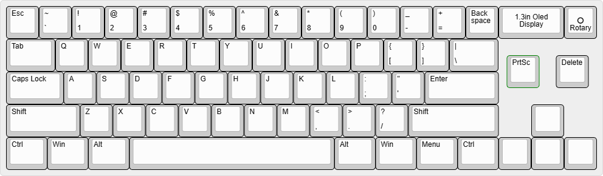

# Devlog:

## 30/08/26 | Session - 1: `1hr 21min`

Understood all basics of this program like how grants work and how to log hours. Also created github repo for OpenBoard. As i was new to this program i took me some time to understand this program.

## 30/08/26 | Session - 2: `1hr 35min`

Completed "Planning Your Keyboard" step, decided all features i want in my keybaord. I decided make this keyboard wireless. Added a 0.96inch Oled display to show battery percentage and a rotary module to adjust volume. Used  to create layout of my keyboard.

